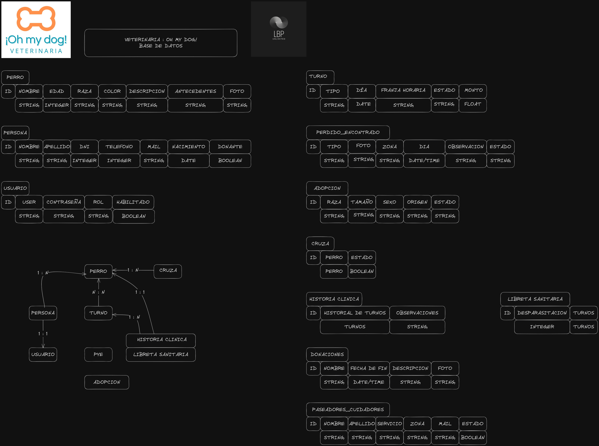

# README

Que hice?

```bash
git clone [repo]
cd [repo]
rails new . -d postgresql
rails db:create
rails db:migrate
```

Para correrlo en otra maquina no hay que hacer el 
```
rails new . -d postgresql
```
Pero si habra que correr las intrucciones de la base de datos

## To Do
Hay que modelar la base de datos, del lab2 entiendo se puede hacer
```
rails generate model Dog name:string birth:date color:string
rails db:migrate
```
| id | name     | race   | birth      | color |
|----|----------|--------|------------|-------|
| 5  | firulais | lassie | 2023-09-11 | brown |


## Base de Datos

